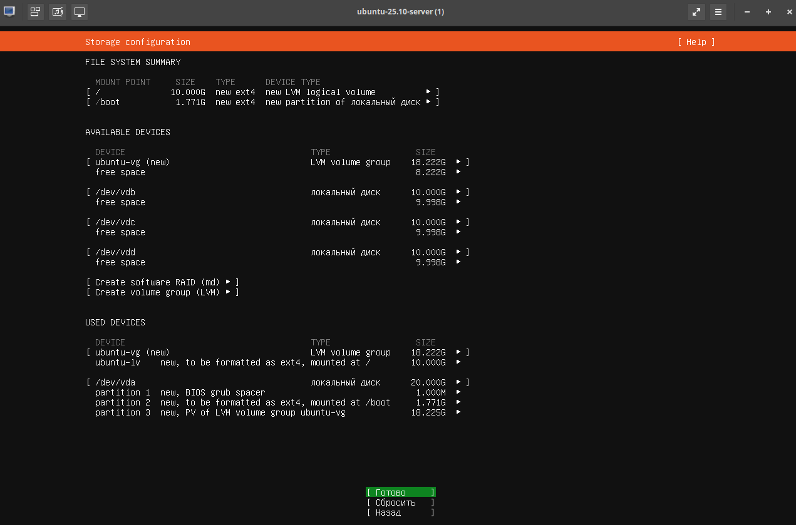
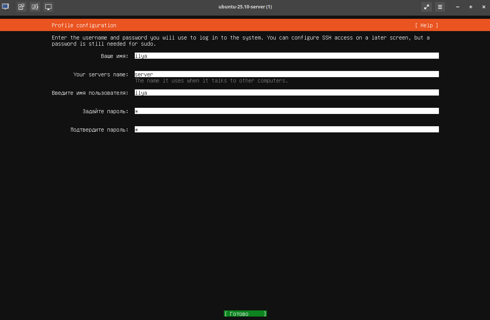

# soft lockup RAID 5

## **Проблема**
https://lore.kernel.org/linux-raid/29d69e586e628ef2e5f2fd7b9fe4e7062ff36ccf.camel@yandex.ru/T/#t
https://bugzilla.kernel.org/show_bug.cgi?id=219030

Существует известная в сообществе проблема локапа в ядре, возникающая при использовании RAID5 или 6 для VDO томов с включенной дедупликацией и компрессией, в момент поломки одного из дисков в группе.

Баг при небольшой нагрузке воспроизводится не всегда, но при указанном профиле нагрузки fio практически в 100% случаев.

При рассмотрении вариантов решения проблемы нужно учесть, что LVM подсистема очень активно разрабатывается, особенно в части VDO. Выяснили, что проблема зависаний известна давно, но происходит в зависимости от версий ядра в разных модулях. 

Модули при переходе от версии к версии имели до 60% измененных строк – то есть просто доработка кода если и возможна, велики риски что фикс не будет работать на новом ядре.

Минимальные шаги к воспроизведению: 

1. Создать один ДеКо том 
2. Дать нагрузку
3. Немного подождать
4. Выдернуть диск из состава пула
5. Через 30 секунд наблюдаем софт локап 

## **1. Подготовка окружения**

### **Установите необходимые пакеты**
```bash
sudo apt update
sudo apt install -y qemu-kvm libvirt-daemon-system libvirt-clients bridge-utils virt-manager fio lvm2 vdo mdadm
```

### **Добавьте пользователя в группу libvirt**
```bash
sudo usermod -aG libvirt $(whoami)
sudo usermod -aG kvm $(whoami)
newgrp libvirt
```

---

## **2. Создание виртуальных дисков**

### **Создайте три виртуальных диска для RAID5**
```bash
qemu-img create -f raw disk1.img 30G
qemu-img create -f raw disk2.img 30G
qemu-img create -f raw disk3.img 30G
```
Рекомендуется хранить образы и диски в /var/lib/libvirt/images/, чтобы избежать проблем с правами.
```bash
sudo mv /home/ilya/softlockup/disk1.img /var/lib/libvirt/images/
sudo mv /home/ilya/softlockup/disk2.img /var/lib/libvirt/images/
sudo mv /home/ilya/softlockup/disk3.img /var/lib/libvirt/images/
```
### **Подключите диски к виртуальной машине**
```bash
sudo mkdir -p /var/lib/libvirt/boot/
sudo cp /home/ilya/softlockup/ubuntu-25.10-live-server-amd64.iso /var/lib/libvirt/boot/
sudo chown libvirt-qemu:libvirt-qemu /var/lib/libvirt/boot/ubuntu-25.10-live-server-amd64.iso
```

```bash
sudo virt-install \
  --name ubuntu-25.10-server \
  --memory 4096 \
  --vcpus 4 \
  --disk path=/var/lib/libvirt/images/ubuntu-25.10.qcow2,size=40,format=qcow2 \
  --disk path=/var/lib/libvirt/images/disk1.img,device=disk,bus=virtio,format=raw,size=30 \
  --disk path=/var/lib/libvirt/images/disk2.img,device=disk,bus=virtio,format=raw,size=30 \
  --disk path=/var/lib/libvirt/images/disk3.img,device=disk,bus=virtio,format=raw,size=30 \
  --cdrom /var/lib/libvirt/boot/ubuntu-25.10-live-server-amd64.iso \
  --network bridge=virbr0 \
  --graphics spice \
  --os-variant ubuntu25.10 \
  --check all=off
```




username: ilya
password: 1


```
Увеличьте размер образа
```bash
sudo qemu-img resize /var/lib/libvirt/images/ubuntu-25.10.qcow2 +20G
```

Если хотите использовать графический интерфейс для подключения к ВМ:
```bash
sudo apt install virt-viewer
sudo virt-viewer
virt-viewer --connect qemu:///system --wait ubuntu-25.10-server

```
Остановить:
```bash
virsh shutdown raid5_vdo_test
```
---

### **Подключитесь к виртуальной машине**
Проверить что ВМ запущена:
```bash
sudo virsh list --all
sudo virsh start ubuntu-25.10-server
sudo virsh console ubuntu-25.10-server
```

Убедитесь, что сеть default активна
На хостовой машине выполните:
```bash
sudo virsh net-list --all
```

## **3. Настройка RAID5 и VDO внутри ВМ**

### **Загрузитесь в ВМ и определите диски**
```bash
lsblk
```
Вы увидите три дополнительных диска (например, `/dev/vdb`, `/dev/vdc`, `/dev/vdd`).

### **Создайте RAID5 и VDO том**
Установите пакет vdo
```bash
sudo apt update
sudo apt install vdo -y
```

Создайте скрипт `mk_raid5_manually.sh`:
```bash
#!/bin/bash
set -exu
if [ "$#" -ne 3 ]; then
    echo "Usage: $(basename $0) disk1 disk2 disk3"
    exit 1
fi

# Создайте физические тома и группу томов
pvcreate -f "$1" "$2" "$3"
vgcreate p_r5 "$1" "$2" "$3"

# Создайте RAID5 логический том
lvcreate --type raid5 -i 2 -L 20G -I 64K -n vdo_internal_deco_vol p_r5 -y

# Преобразуйте в VDO-пул
lvconvert -y --type vdo-pool --virtualsize 100G -n deco_vol p_r5/vdo_internal_deco_vol
```

Запустите скрипт:
```bash
chmod +x mk_raid5_manually.sh
sudo ./mk_raid5_manually.sh /dev/vdb /dev/vdc /dev/vdd
```

Возможные проблемы:
- нарезал маленькие диски, надо было как минимум 20Gb
- не хватило места для RAID5

```bash
ilya@server:~$ sudo vgdisplay p_r5
  --- Volume group ---
  VG Name               p_r5
  System ID             
  Format                lvm2
  Metadata Areas        3
  Metadata Sequence No  3
  VG Access             read/write
  VG Status             resizable
  MAX LV                0
  Cur LV                1
  Open LV               0
  Max PV                0
  Cur PV                3
  Act PV                3
  VG Size               <29,99 GiB
  PE Size               4,00 MiB
  Total PE              7677
  Alloc PE / Size       1923 / 7,51 GiB
  Free  PE / Size       5754 / <22,48 GiB
  VG UUID               wgzVcM-XgUX-TpkI-doqj-uNun-YS2l-9LLY23
```
Посмотрите на строку Free PE / Size. Если места недостаточно, уменьшите размер RAID5 или добавьте ещё один диск.

lvconvert -y --type vdo-pool --virtualsize 4MiB -n deco_vol p_r5/vdo_internal_deco_vol

---

## **4. Запуск нагрузки с помощью fio**
Установить:
```
sudo apt install fio
```

### **Создайте конфиг для fio (`fio_write.fio`)**
```ini
[test IOPS]
blocksize=8k
filename=/dev/p_r5/deco_vol
filesize=100G
direct=1
buffered=0
ioengine=libaio
iodepth=32
rw=randrw
rwmixwrite=30
numjobs=4
group_reporting
time_based
runtime=99h
clat_percentiles=0
unlink=1
```

### **Запустите fio**
```bash
sudo fio ./fio_%write.fio
```

---

## **5. Эмуляция отключения диска**

### **Найдите PID процесса QEMU**
```bash
ps aux | grep qemu
```

Сначала проверьте, какие диски подключены к виртуальной машине:
```bash
ilya@FL:~/softlockup$ sudo virsh domblklist ubuntu-25.10-server
 Target   Source
------------------------------------------------------
 vda      /var/lib/libvirt/images/ubuntu-25.10.qcow2
 vdb      /var/lib/libvirt/images/disk1.img
 vdc      /var/lib/libvirt/images/disk2.img
 vdd      /var/lib/libvirt/images/disk3.img
 sda      -

```
а) Посмотрите список блоковых устройств в мониторе QEMU
```bash
ilya@FL:~/softlockup$ sudo virsh qemu-monitor-command ubuntu-25.10-server --hmp "info block"
libvirt-5-format: /var/lib/libvirt/images/ubuntu-25.10.qcow2 (qcow2)
    Attached to:      /machine/peripheral/virtio-disk0/virtio-backend
    Cache mode:       writeback

libvirt-4-storage: /var/lib/libvirt/images/disk1.img (file)
    Attached to:      /machine/peripheral/virtio-disk1/virtio-backend
    Cache mode:       writeback

libvirt-3-storage: /var/lib/libvirt/images/disk2.img (file)
    Attached to:      /machine/peripheral/virtio-disk2/virtio-backend
    Cache mode:       writeback

libvirt-2-storage: /var/lib/libvirt/images/disk3.img (file)
    Attached to:      /machine/peripheral/virtio-disk3/virtio-backend
    Cache mode:       writeback

sata0-0-0: [not inserted]
    Attached to:      sata0-0-0
    Removable device: not locked, tray closed

```
Отключить диск:

```bash
sudo virsh qemu-monitor-command ubuntu-25.10-server --hmp "drive_del libvirt-2-storage"
```
- так не дает

так дает
```bash
sudo virsh detach-disk ubuntu-25.10-server vdd --persistent
```

---

## **6. Мониторинг логов**

### **Просмотрите логи ядра**
```bash
dmesg -w
```
Ожидайте появления сообщений о soft lockup и стектрейсах.

---

## **7. Восстановление диска (опционально)**
Чтобы вернуть диск обратно:
Добавить "на горячую" не получается:
```bash
ilya@FL:~/softlockup$ sudo virsh qemu-monitor-command ubuntu-25.10-server --hmp "drive_add 0 file=/var/lib/libvirt/images/disk3.img,format=raw,if=none,id=libvirt-2-storage"
Could not open '/var/lib/libvirt/images/disk3.img': Permission denied
```

```bash
ilya@FL:~/softlockup$ sudo virsh qemu-monitor-command ubuntu-25.10-server --hmp "device_add virtio-blk-pci,drive=libvirt-2-storage,id=libvirt-2-storage"Error: Bus 'pcie.0' does not support hotplugging
```

1. Подключите диск через редактирование конфигурации ВМ
а) Остановите ВМ
```bash
sudo virsh shutdown ubuntu-25.10-server
sudo virsh destroy ubuntu-25.10-server  # Если не останавливается, у меня он только так выключился
```
б) Редактируйте конфигурацию ВМ
```bash
sudo virsh edit ubuntu-25.10-server
```
в) Добавьте секцию с диском

Найдите секцию <devices> и добавьте описание диска:
```xml
<disk type='file' device='disk'>
  <driver name='qemu' type='raw'/>
  <source file='/var/lib/libvirt/images/disk3.img'/>
  <target dev='vdd' bus='virtio'/>
  <address type='pci' domain='0x0000' bus='0x06' slot='0x00' function='0x0'/>
</disk>
```

---

# Анализ
Давайте разберём каждую строку из вашего лога, чтобы понять, что происходит в системе и почему возникает **soft lockup** (зависание ядра).

---

### **1. Основная строка ошибки**
```
[ 5595.839255] watchdog: BUG: soft lockup - CPU#1 stuck for 339s! [mdX_raid5:3222]
```
- **Что это значит?**
  Ядро Linux обнаружило, что **процессор №1 завис на 339 секунд** в процессе `mdX_raid5` (поток RAID5). Это указывает на то, что процесс обработки RAID5 заблокирован и не может завершиться.

---

### **2. Список загруженных модулей ядра**
```
[ 5595.839258] Modules linked in: dm_vdo dm_bufio lz4_compress dm_raid qrtr cfg80211 binfmt_misc intel_rapl_msr intel_rapl_common intel_uncore_frequency_common intel_pmc_core pmt_telemetry pmt_discovery pmt_class intel_pmc_ssram_telemetry intel_vsec kvm_intel kvm irqbypass rapl snd_hda_codec_generic snd_hda_intel snd_hda_codec snd_hda_core snd_intel_dspcfg snd_intel_sdw_acpi snd_hwdep snd_pcm i2c_i801 snd_timer i2c_smbus i2c_mux snd lpc_ich soundcore joydev input_leds mac_hid sch_fq_codel msr dm_multipath efi_pstore nfnetlink vsock_loopback vmw_vsock_virtio_transport_common vmw_vsock_vmci_transport vsock vmw_vmci dmi_sysfs qemu_fw_cfg ip_tables x_tables autofs4 btrfs blake2b_generic raid10 raid456 async_raid6_recov async_memcpy async_pq async_xor async_tx xor raid6_pq raid1 raid0 linear hid_generic usbhid hid polyval_clmulni ghash_clmulni_intel virtio_rng psmouse ahci virtio_gpu libahci serio_raw virtio_dma_buf aesni_intel
```
- **Что это значит?**
Здесь перечислены все загруженные модули ядра, важные для нас:
  - `dm_vdo` — модуль для VDO (Virtual Data Optimizer).
  - `dm_raid` — модуль для RAID-устройств.
  - `raid456` — модуль для RAID 4, 5, 6.
  - Другие модули, связанные с сетью, звуком, виртуализацией и т.д.

---

### **3. Информация о системе и ядре**
```
[ 5595.839286] CPU: 1 UID: 0 PID: 3222 Comm: mdX_raid5 Tainted: G             L      6.17.0-6-generic #6-Ubuntu PREEMPT(voluntary)
```
- **Что это значит?**
  - **CPU: 1** — ошибка произошла на процессоре №1.
  - **PID: 3222** — идентификатор процесса, который завис.
  - **Comm: mdX_raid5** — имя процесса (поток RAID5).
  - **Tainted: G L** — флаги, указывающие на возможные проблемы:
    - `G` — загружены проприетарные модули.
    - `L` — загружены модули, не имеющие лицензии GPL.
  - **6.17.0-6-generic** — версия ядра.

---

### **4. Информация о железе**
```
[ 5595.839289] Hardware name: QEMU Standard PC (Q35 + ICH9, 2009), BIOS 1.16.3-debian-1.16.3-2 04/01/2014
```
- **Что это значит?**
  Виртуальная машина работает на **QEMU** с эмуляцией стандартного ПК (чипсет Q35 + ICH9).

---

### **5. Информация о регистрах процессора**
```
[ 5595.839289] RIP: 0010:_raw_spin_unlock_irq+0x15/0x60
[ 5595.839294] Code: cc cc 0f 1f 00 90 90 90 90 90 90 90 90 90 90 90 90 90 90 0f 1f 44 00 00 55 48 89 e5 e8 a2 00 00 00 90 fb 0f 1f 44 00 00 <65> ff 0d f4 49 b6 01 74 10 5d 31 c0 31 d2 31 c9 31 f6 31 ff c3 cc
```
- **Что это значит?**
  - **RIP** — адрес инструкции, на которой произошло зависание (`_raw_spin_unlock_irq`).
  - **Code** — дамп машинного кода, который выполнялся в момент зависания.

[Ассемблерный листиинг](dump_asm.md)

---

### **6. Состояние регистров процессора**
```
[ 5595.839294] RSP: 0018:ffffd3ab825e3ce0 EFLAGS: 00000246
[ 5595.839296] RAX: 0000000000000001 RBX: ffff8a8c8f012800 RCX: 0000000000000000
[ 5595.839296] RDX: ffff8a8c81ad9ae0 RSI: 0000000000000000 RDI: ffff8a8c8f01281c
[ 5595.839297] RBP: ffffd3ab825e3ce0 R08: 0000000000000000 R09: 0000000000000000
[ 5595.839297] R10: 0000000000000000 R11: 0000000000000000 R12: 0000000000000005
[ 5595.839298] R13: ffff8a8c8f01281c R14: 0000000000000000 R15: 0000000000000000
[ 5595.839299] FS:  0000000000000000(0000) GS:ffff8a8d43aff000(0000) knlGS:0000000000000000
[ 5595.839299] CS:  0010 DS: 0000 ES: 0000 CR0: 0000000080050033
[ 5595.839300] CR2: 0000000042b1d000 CR3: 000000017e440003 CR4: 0000000000772ef0
[ 5595.839303] PKRU: 55555554
...
```
- **Что это значит?**
  Здесь показаны значения регистров процессора в момент зависания. Это помогает разработчикам ядра понять, что именно выполнялось.

---

### **7. Трассировка стека (Call Trace)**
```
[ 5595.839303] Call Trace:
[ 5595.839307]  <TASK>
[ 5595.839307]  raid5_get_active_stripe+0x163/0x310 [raid456]
[ 5595.839313]  ? do_release_stripe+0x211/0x3c0 [raid456]
[ 5595.839316]  raid5d+0x2d0/0x650 [raid456]
[ 5595.839320]  md_thread+0x9f/0x1b0
[ 5595.839323]  ? __pfx_autoremove_wake_function+0x10/0x10
[ 5595.839325]  ? __pfx_md_thread+0x10/0x10
[ 5595.839326]  kthread+0x108/0x220
[ 5595.839328]  ? __pfx_kthread+0x10/0x10
[ 5595.839329]  ret_from_fork+0x131/0x150
[ 5595.839331]  ? __pfx_kthread+0x10/0x10
[ 5595.839332]  ret_from_fork_asm+0x1a/0x30
[ 5595.839334]  </TASK>
```
- **Что это значит?**
  Трассировка стека показывает последовательность вызовов функций, которые привели к зависанию:
  - `raid5_get_active_stripe` — функция RAID5, которая пыталась получить активную полосу.
  - `raid5d` — основной поток RAID5.
  - `md_thread` — поток управления RAID-устройством.
  - `kthread` — функция ядра, управляющая потоками.

---

## **Варианты?**

1. **Обновите ядро**:
   Ждать обновления версия ядра

2. **Отключите VDO**:
   Попробуйте использовать RAID5 без VDO

3. **Используйте другой уровень RAID**:
   RAID10 может быть более стабильным решением для VDO.

4. **Заплатка**:
   Таймаут достаточно болшой > 300 секунд. Можно поставить таймер и отпускать спинлок

---

Если проблема повторяется, можно попробовать собрать отладочную информацию и отправить её разработчикам ядра.
